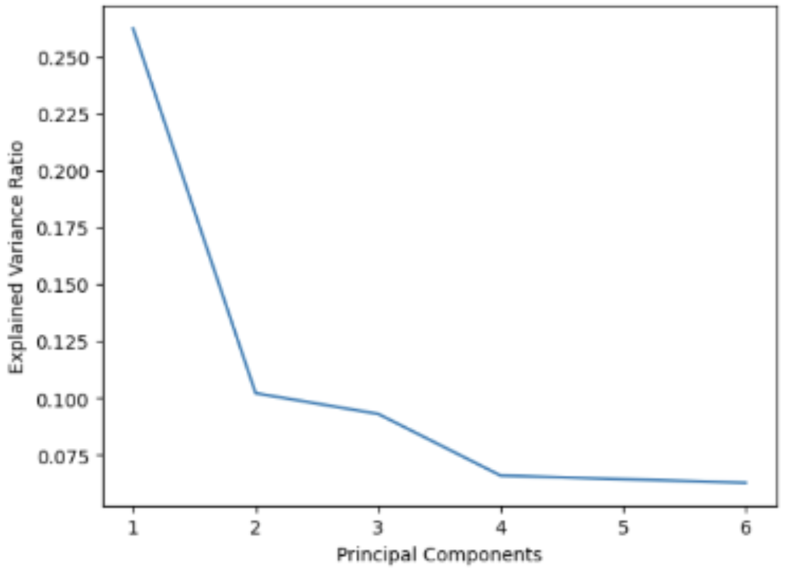
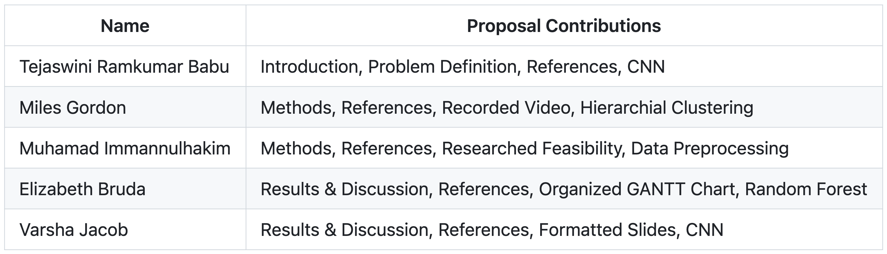

# Automated Classification of Fruit Spoilage: Detection and Analysis
Elizabeth Bruda, Miles Gordon, Muhamad Imannulhakim, Varsha Jacob, Tejaswini Ramkumar Babu

# Final Report

## Introduction
### Literature Review
The agricultural industry faces a challenge in effectively identifying rotten fruits. Manual classification of fruits is tedious for farmers and prone to human error and fatigue [1]. Unlike humans, machines do not tire after repetitive tasks, making them ideal for this problem. Spoiled fruit poses a risk to fresh produce if not quickly removed. Thus, early detection of rotten fruits is crucial. Computer vision and machine learning can be used to classify fresh and rotten fruits automatically, reducing human effort, cost, and time [2]. 

### Description of Dataset
Our dataset includes fresh and rotten strawberries, peaches, and pomegranates. The images have white backgrounds and are .jpegs. All the images are 300x300. There are 1500 images, with 250 for each of the six classes.

## Problem Definition
### Problem
The goal of our project is to discover and compare methods of machine-learning classification to classify the type of fruit and predict if a fruit is rotten.

### Motivation
We want to help reduce food waste by identifying rotten fruit ahead of time. Unlike humans, machines can quickly and repeatedly perform the same task without getting tired. Previous attempts at solving this problem have used Convolutional Neural Networks (CNN) to extract features from fruit images [1][3]. We plan to refine this approach by integrating CNN as one of many models in sequence, including PCA, SIFT, and Agglomerative Clustering.

## Methods
For preprocessing, we used scaling to normalize image pixel values, data augmentation to generate a more diverse dataset by applying random transformations to existing images (both using tf.keras.preprocessing.image.ImageDataGenerator), and PCA (sklearn.decomposition.PCA) to reduce image dimensionality and lower training computational complexity. We performed hierarchical clustering (sklearn.cluster.AgglomerativeClustering) to create a predictive model based on proximity to rotten/fresh clusters, and compare the results to those from training a CNN on our labeled data using categorial cross-entropy loss (tensorflow.keras.Model.fit).

### Data Preprocessing
The dataset was initially compressed in a ZIP file as fruit_data.zip, and then it was extracted to make the raw images accessible for preprocessing. Following extraction, a cleaning process was applied to the destination directory to remove any pre-existing data. To facilitate effective model training and evaluation, the dataset was then divided into three distinct sets: training, validation, and testing. The data was split using stratified sampling to maintain an even distribution of classes across each set, with ratios set to 65% for training, 20% for validation, and 15% for testing. 

For Data Augmentation, we implement several methodologies, such as rotation, brightness adjustment, shear, zoom, and flipping. This process, applied exclusively to the training set, aimed to enhance the model's generalization capability by exposing it to a broader range of data variations. For the validation and test sets, a simple rescaling was applied to normalize pixel values to a [0, 1] range, ensuring model input consistency and improving computational efficiency.

Those preprocessing steps were taken through the use of data generators so it can dynamically load and process images in batches during model training. This approach allowed for the efficient handling of large datasets that might not fit entirely into memory and facilitated real-time data augmentation. The generators were configured to serve the training, validation, and testing datasets with their respective preprocessing specifications, ensuring that each set was optimally prepared for its role in the model training and evaluation process.

### Hierarchical Clustering
To perform hierarchical clustering—which we felt was the most appropriate unsupervised learning algorithm for this task because of its clear association with classification and its ability to perceive hierarchical subclasses (such as rotten/fresh status within fruit types)—we extracted SIFT descriptors from our images. SIFT descriptors are scale-invariant and rotation-invariant image descriptors that encode “keypoints” (based on the presence of corners and edges) based on gradient. These are a classic means of representing images in machine learning problems—it is highly likely that the clear change in color between the background and the fruit led to the fruit composing keypoints, and we hoped that the descriptors would be differentiable both by fruit type and by whether the fruit shown is rotten or fresh. To make the complexity reasonable and filter out noise, we limited the number of keypoints considered to 1000, likely more than enough to encode entire pieces of fruit including their specific details (though across several trials with different numbers of keypoints considered, there was no significant change in accuracy, only in learning time). We then analyzed dendograms on a random sample of the data with every linkage type, and choose the linkage type that seemed to have the most clear division into 6 clusters, which in this case was Ward’s linkage (which adds greedily to clusters in a way that minimizes the squared distance from the mean for that cluster). We then trained AgglomerativeClustering using Ward's linkage and analyzed the results.

### Decision Tree
We decided to train a Decision Tree classifier on the images to see if the features follow a tree-like structure. First, we preprocessed the data using the methods described above and split the data into training and testing datasets. Then, we constructed a combined data matrix that has all of the pixel values of the black and white training and testing images. We decided to run PCA on the data since using pixels as the features would cause us to have thousands of features (since the images are 300x300 pixels). Before running PCA, we found the value of the mean image (shown in the visualization section) and then subtracted it from the combined data. Then, we ran PCA on the data and selected the top 5 components. We chose the top 5 components since the PCA visualization below shows that there is an elbow at 4 principal components when running PCA on the data. We trained a Decision Tree Classifier on the training data and tested it on the training data.

#### [Visualizations](https://github.com/tejaswini-rb/project-proposal-ml/blob/main/DecisionTree.ipynb)

PCA Visualization

Mean Image Visualization

Decision Tree Image

### CNN
Since we needed to classify images into six classes, Convolutional Neural Networks (CNNs) was the model we chose since CNNs have multiple layers for feature detection and finding patterns in the image data. Furthermore, our image dataset is a relatively small size, as they are only 300 x 300 pixels each, so it is simple to pass the images themselves into a CNN without much need for complex preprocessing algorithms. A CNN is able to isolate the important features and find local patterns, which makes it more accurate and suited for this model than other methods.

We chose to use the Adam optimizer for the CNN because it worked the best for our mode compared to the other options we tried (Adagrad, AdamW, and SGD). The best hyperparameters for our dataset with the Adam optimizer was 50 epochs and a learning rate of 0.006. Our quantitative metrics were accuracy, top-k = 2 (probability that the true label is among the model’s top 2 predictions), and average speed. Here are our visualizations below:

[Optimizer = Adam, Epochs = 10](https://github.com/tejaswini-rb/project-proposal-ml/blob/main/CNNs/CNN_10_Epochs.ipynb)

[Optimizer = Adam, Learning Rate = 0.006, Epochs = 30](https://github.com/tejaswini-rb/project-proposal-ml/blob/main/CNNs/CNN_30_Epochs.ipynb)

[Optimizer = Adam, Learning Rate = 0.006, Epochs = 50](https://github.com/tejaswini-rb/project-proposal-ml/blob/main/CNNs/CNN_50_Epochs.ipynb)

Furthermore, we tested out other [CNN architectures](https://github.com/tejaswini-rb/project-proposal-ml/blob/main/CNNs/CNN_ResNet_MobileNetV2_EfficientNet.ipynb): Resnet50, EfficientNet, and MobileNetV2, and we used accuracy, top-k = 2, and average speed metrics to measure the effectiveness of these models as well. Here are the visualizations:

#### ResNet50

#### EfficientNet

#### MobileNetV2

These visualizations display one of many trials for each model. The summary of every trial's accuracy, top k = 2, and speed can be seen in the results section below.

## Results
### Hierarchical Clustering Results
[Visualization](https://github.com/tejaswini-rb/project-proposal-ml/blob/main/Hierarchical_Clustering.ipynb)

To evaluate the performance of our hierarchical clustering algorithm, we printed the distribution of classes (consisting of a type of fruit and a rotten/fresh designation) in every cluster, and recorded the percentage of items from each class that were assigned to a cluster where a plurality of other members were in their class, as well as the extent of each plurality.

#### Performance Overview:
- **Cluster 0:**
  - Label ['fresh' 'peach']: 10 occurrences
  - Label ['fresh' 'pomegranate']: 47 occurrences
  - Label ['fresh' 'strawberry']: 70 occurrences
  - Label ['rotten' 'peach']: 107 occurrences
  - Label ['rotten' 'pomegranate']: 79 occurrences
  - Label ['rotten' 'strawberry']: 96 occurrences

- **Cluster 1:**
  - Label ['fresh' 'peach']: 193 occurrences
  - Label ['fresh' 'pomegranate']: 199 occurrences
  - Label ['fresh' 'strawberry']: 26 occurrences
  - Label ['rotten' 'peach']: 119 occurrences
  - Label ['rotten' 'pomegranate']: 50 occurrences
  - Label ['rotten' 'strawberry']: 5 occurrences

- **Cluster 2:**
  - Label ['fresh' 'pomegranate']: 1 occurrence
  - Label ['fresh' 'strawberry']: 68 occurrences
  - Label ['rotten' 'peach']: 9 occurrences
  - Label ['rotten' 'pomegranate']: 27 occurrences
  - Label ['rotten' 'strawberry']: 63 occurrences

- **Cluster 3:**
  - Label ['fresh' 'peach']: 1 occurrence
  - Label ['fresh' 'pomegranate']: 12 occurrences
  - Label ['fresh' 'strawberry']: 60 occurrences
  - Label ['rotten' 'peach']: 22 occurrences
  - Label ['rotten' 'pomegranate']: 28 occurrences
  - Label ['rotten' 'strawberry']: 56 occurrences

- **Cluster 4:**
  - Label ['fresh' 'peach']: 46 occurrences
  - Label ['fresh' 'pomegranate']: 52 occurrences
  - Label ['fresh' 'strawberry']: 15 occurrences
  - Label ['rotten' 'peach']: 84 occurrences
  - Label ['rotten' 'pomegranate']: 46 occurrences
  - Label ['rotten' 'strawberry']: 21 occurrences

- **Cluster 5:**
  - Label ['fresh' 'strawberry']: 11 occurrences
  - Label ['rotten' 'peach']: 2 occurrences
  - Label ['rotten' 'pomegranate']: 20 occurrences
  - Label ['rotten' 'strawberry']: 10 occurrences

#### Metrics:

- **Classes in Cluster with Plurality:**
  - Fresh pomegranates in cluster with plurality: 199/311 = 63.99%
  - Rotten pomegranates in cluster with plurality: 20/250 = 8%
  - Fresh strawberries in cluster with plurality: 128/250 = 51.2%
  - Rotten strawberries in cluster with plurality: 0/251 = 0%
  - Fresh peaches in cluster with plurality: 0/250 = 0%
  - Rotten peaches in cluster with plurality: 191/343 = 55.69%
  - Total: 538/1655 = 32.51%

- **Strength of Pluralities:**
  - Cluster 0: 107/409 = 26.16%
  - Cluster 1: 199/592 = 33.61%
  - Cluster 2: 68/168 = 40.48%
  - Cluster 3: 60/179 = 33.52%
  - Cluster 4: 84/264 = 31.82%
  - Cluster 5: 20/43 = 46.51%
  - Average Percentage: 35.35% (median: 33.57%)

The performance of hierarchical clustering on this task was extremely poor; almost 2/3rds of our fruits were assigned to clusters in which they did not have a plurality, indicating a very low predictive ability of our clustering. Furthermore, the average frequency of the class with a plurality in our clusters is 33.57%, suggesting that the fruits are relatively evenly distributed and there is not a significant correlation between classes of fruit and to which clusters they were assigned. While there are some patterns, like clusters 2 and 3 being dominated by strawberries of some sort, ultimately, hierarchical clustering was unable to produce a useful predictive model with our SIFT descriptors.
One reason for this is that image data is very high-dimensional, leading to the curse of dimensionality. Specifically, as the number of dimensions increases, differences in distance become less meaningful because there are so many dimensions in which such differences can occur. However, to complete this task, we must have an encoding of not only fruits but also features such as mold within the fruits, making it impossible to resolve this problem by traditional dimensionality reduction because we lose our predictive abilities before we can reduce the problem enough for hierarchical clustering to be a useful task.

Unsupervised learning is uncommon for image classification, and these results likely reveal why that may be the case. The next steps for our project are to pivot towards supervised learning methods like CNNs that are more suited for image classification tasks. We can also consider exploring other means of image encoding to see if we can achieve better performance with hierarchical clustering, but SIFT descriptors are a well-known standard that seemingly should have been able to properly encode this data, making it unlikely that we can significantly achieve performance by relying on unsupervised methods.

### Decision Tree Results
Initially, our Decision Tree classifier had 100% accuracy on the training data and 32% accuracy on the testing data. The micro precision score was 0.308. It also only took 0.032 seconds to perform a prediction using clf.predict() on the testing data. However, after tuning the classifier, our testing accuracy increased to 72.55%. 

We believe that our Decision Tree classifier was initially overfitted since the training accuracy is quite high (100%) but the testing accuracy is low (30%). Additionally, the image of the Decision Tree has around 18 levels which is a sign of overfitting since a decision tree is most optimal when it has fewer levels. A cause of this would be the fact that some of the pixels are being used as features meaning that even quite small changes in pixel features add another level. Additionally, the decision tree used PCA to select the top features, however, since our images were only 300x300 pixels this may have not been needed. On the other hand, our model makes predictions quite quickly since it only took 0.032 seconds to make a prediction and this is a benefit of using a Decision Tree classifier. 

To reduce overfitting in our Decision Tree classifier we performed tree pruning. We used a hyperparameter search from 5 to 50 in increments of 5 as the max depth parameter for the decision tree using 10-fold cross validation.  Pruning removes parts of the tree that don’t help as much with classifying data. This reduced overfitting by reducing the complexity and size of the tree. We recorded the cross validation error for each max depth parameter value, which is displayed on one of the visualizations above. We found that the optimal maximum depth value was 5 levels. So, we trained a decision tree again with this selected parameter and got a testing accuracy of 72.55% which was a 40% increase from the previous classifier. This demonstrated how tree pruning was able to reduce overfitting in our model. In the future, we could further optimize our model by trying ensemble methods using Random Forests since these would introduce more variance. The random forest randomly selects features and datapoints to use so it would rely less on certain features. 

### CNN Results
Through multiple trials, we found that accuracy generally increased as loss decreased with each epoch, although there were fluctuations. 

**CNN**: For the vanilla CNN, we found that the Adam optimizer yielded a very high accuracy for 10 epochs, and that although our highest accuracy for CNN was 81%, most of the top k accuracies at each epoch were above 90%, showing that the correct class was within the model’s top two predictions. However, there were variations in performance runs with the results plateauing after about 25 epochs as shown in the visualizations, so this tells us there is room for better refinement of our results. 

**ResNet50**: ResNet50 gave mediocre results. The accuracies and the top k accuracies at each epoch showed the greatest variance with the hyperparameter changes (from increasing the numbers of epochs to 20 and changing the learning rate to be extremely small). Doubling the number of epochs increased the accuracy from 30% to 50%, and the top k = 2 accuracy jumped from 59% to 91%. The model took a relatively short time to run at around 24 seconds per epoch.

**EfficientNet**: We found that the EfficientNet model yielded the worst results with the accuracy consistently being around 20% regardless of the extent in which the hyperparameters, such as learning rate, were altered. Most of the top k accuracies at each epoch were around 35%, meaning the correct prediction was not often not in one of the top two predictions made by this model. It performed the worst out of all the other models in our dataset, but, the model took the shortest time to run at an average of 23 seconds per epoch.

**MobileNetV2**: We found that the MobileNetV2 model yielded the best results at 97.9% accuracy. Most of the top k accuracies at each epoch were above 99%, showing that the correct class was consistently within the model’s top two predictions. This model performed the best out of all the other models in our dataset! However, the model took the longest to run at an average of 35 seconds per epoch.
[Here are the results summarized.](https://github.com/tejaswini-rb/project-proposal-ml/blob/main/CNNs)

### Comparison of Algorithms/Models
Out of our supervised models, we found that CNNs were the most accurate, and out of the CNN models we implemented, MobileNetV2 had the best results, with an accuracy of 97.9%. Comparatively, the other CNN models had accuracies of 81% for the vanilla CNN, 50% for ResNet50, and 20% for EfficientNet. The DecisionTree model, once tuned, also had a relatively high accuracy of 72.55%, although its testing accuracy was quite low before tuning the model. Comparatively, our unsupervised model, hierarchical clustering, only had an accuracy of around 30%, which is approximately the same as if the model had randomly guessed between the three types of fruit. 

In terms of speed, the decision tree was the fastest model, though it was prone to overfitting, which decreased the accuracy. The EfficientNet CNN model was the next fastest, but its accuracy was quite low. While MobileNetV2 was the slowest model, it had the highest accuracy. In the future, further tuning on the DecisionTree model could lead to it having higher accuracy while retaining its speed. 

Overall, we found that the MobileNetV2 model was the best suited for image classification for our dataset, though it took the longest out of the models to run. The Vanilla CNN and DecisionTree models could also potentially perform well with more tuning and feature engineering, which would reduce overfitting and lead to increased testing accuracy. 

### Next Steps
Our next steps would be to add more images to the dataset to include more fruit types and stages of rotting, so we can make our model more useful for diffferent types of crops. We will explore other models such as pre-trained CNNs and Vision Transformers to see if we can achieve a better accuracy than MobileNetV2. We will also look into other models, like GANs and other autoregressive models, for data augmentation and dataset expansion. Furthermore, we would optimize the parameters of these models systematically using grid search, random search, or Bayesian optimization. Once we are satisified with the performance of our model, we would create an app that uses the model to help farmers automatically classify rotten fruits and deploy it for use in agriculture.

## References
- [1] Mohd Mohsin Ali, M. Raj, and Deepika Vatsa, “FruizNet Using an Efficient Convolutional Neural Network,” Mar. 2023.
- [2] J N V D Tanuia Nerella, Vamsi Krishna Nippulapalli, Srivani Nancharla, Lakshmi Priya Vellanki, and Pallikonda Sarah Suhasini, “Performance Comparison of Deep Learning Techniques for Classification of Fruits as Fresh and Rotten,” Apr. 2023.
- [3] D. V. Dhande and D. D. Patil, “A Deep Learning Based Model for Fruit Grading Using DenseNet,” International Journal of Engineering and Management Research, vol. 12, no. 5, pp. 6–10, Oct. 2022.
- [4] E. Sonwani, U. Bansal, R. Alroobaea, A. M. Baqasah, and M. Hedabou, “An Artificial  Intelligence Approach Toward Food Spoilage Detection and Analysis,” Frontiers in Public Health, vol. 9, Jan. 2022.
- [5] E. Cai, A. Singh, and D. Marculescu, “Learning-based Power and Runtime Modeling for Convolutional Neural Networks,” Carnegie Mellon University, May 2018.

## Gantt Chart

See [here](https://docs.google.com/spreadsheets/d/1m-W8_CN5DLlSRQmso1E5ofZwSR4k7cMV/edit?usp=sharing&ouid=101081220951400011101&rtpof=true&sd=true) for the full chart.

## Contribution Table

